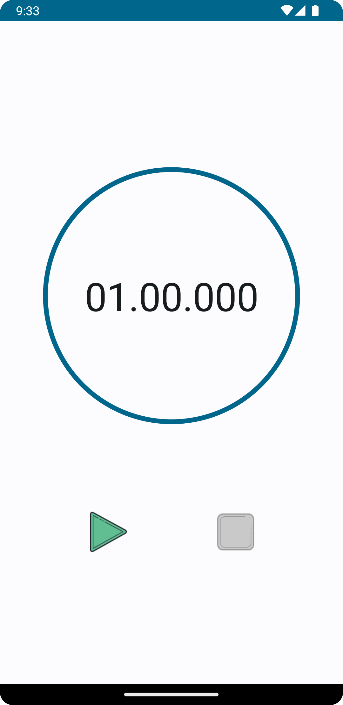

# Timer app
A simple 1 minute countdown timer app which displays seconds and milliseconds also.

## [APK Download link (v1.0)](https://drive.google.com/uc?export=download&id=16-zEsVk-s2CVeBf8cQ5gBQluA0m-Qhy5)

## Approach
- Kotlin
- MVVM Architecture
- DI using Koin
- StateFlow for state management
- Jetpack Compose

## Screenshots

| New                                           | Paused                              | Completed                           |
|-----------------------------------------------|-------------------------------------|-------------------------------------|
|            |  |  |
|              |    |    |
|  |                                     |                                     |
